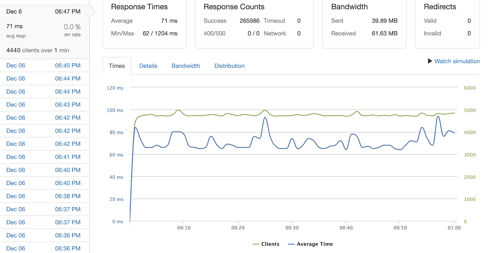

# Grubhub System Design

> Inherited a front-end replica of www.grubhub.com menu page to construct and optimize a system design. The optimized system design generates and seeds 10 million database records under 10 minutes, and returns a query response in 2 ms. When horizontally scaled out to three EC2 instances with Nginx load balancer (Round Robin technique), it achieves a throughput of 4,440 RPS with 0% error rate and latency of 71 ms.



## Requirements <a name="requirements"></a>

You will need [Node.js](https://nodejs.org/en/) and [MongoDB](https://docs.mongodb.com/manual/administration/install-community/) installed on your system.

## Installation & Setup <a name="installation"></a>

Get the code by cloning this repository using git

```bash
git clone https://github.com/wjdwldbs/Grubhub_System_Design.git
```

Once cloned, open the terminal in the project directory and install dependencies locally using npm:

```bash
$ npm install
```

Write and seed data entries with:

```bash
$ npm run seed
$ npm run write
```

Start the app with:

```bash
$ npm start
```