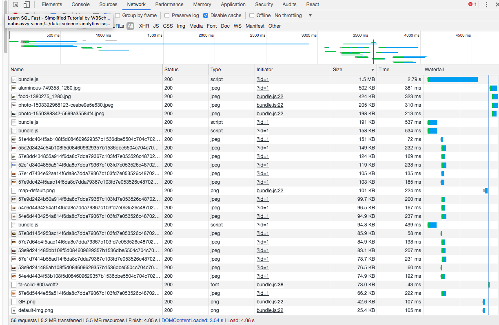

# FEC Service Server (Calvin)
> deployed web site: https://grubhub-mock-calvin.herokuapp.com/?id=1

## grubhub-menu-cart

Tested by Jest in CircleCI


### Related Projects

* [Nav, About sections](https://github.com/hrla29-group-targaryen/nav-about)
* [time-sponsored](https://github.com/hrla29-group-targaryen/time-sponsored)
* [Review, Footer sections](https://github.com/hrla29-group-targaryen/reviews)

#### Usage

```
git clone https://github.com/hrla29-group-targaryen/time-sponsored.git
cd menu-cart
npm install
npm start-calvin
```

#### Requirements

install Nodejs.

#### Development

* [react.js](https://www.npmjs.com/package/react) - The official React.js website
* [express.js](https://www.npmjs.com/package/express) - The official Express.js website
* [mongoose](https://www.npmjs.com/package/mongoose) - The official Mongoose website
* [webpack](https://www.npmjs.com/package/webpack) - The official Webpack website
